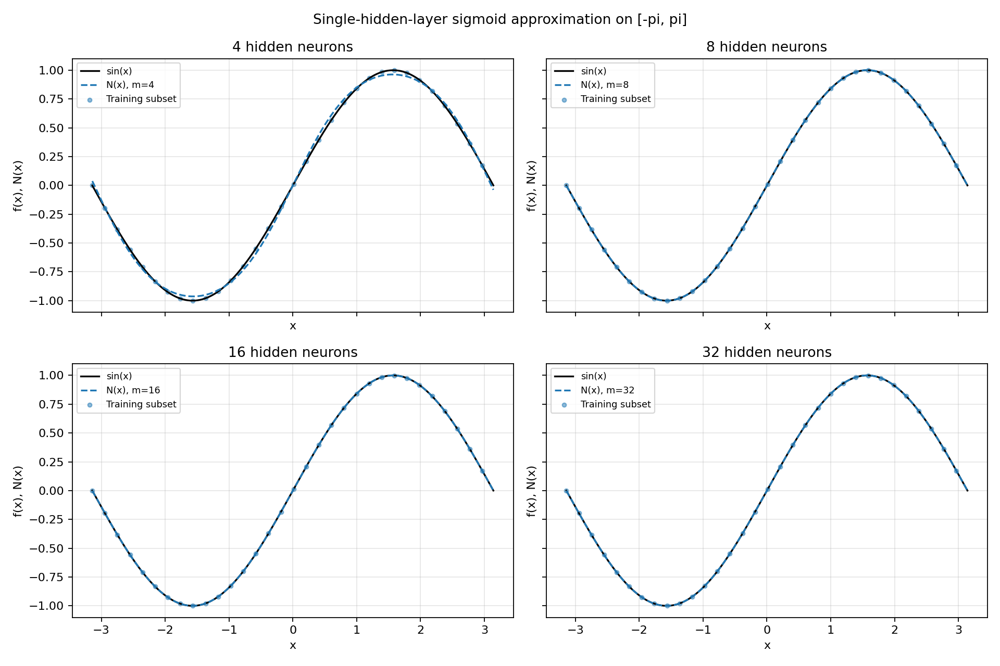
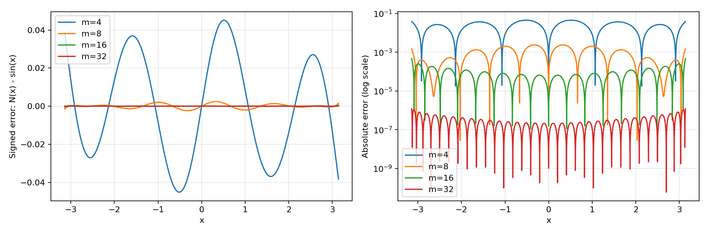
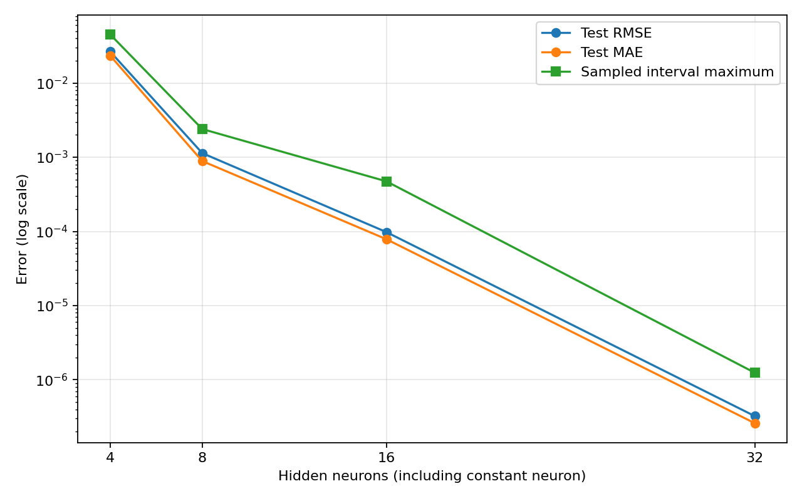

<div dir="rtl">

# تقریب سینوس با شبکهٔ یک لایهٔ پنهان

این مثال عددی تابع $f(x)=\sin(x)$ را روی بازهٔ فشردهٔ $K=[-\pi,\pi]$ با شبکهٔ زیر تقریب می‌زند:

$$N_m(x)=\sum_{j=1}^{m}\alpha_j\,\sigma(w_jx+b_j),\qquad
\sigma(t)=\frac{1}{1+e^{-t}}.$$

کد اصلی در [approximate_sine.py](approximate_sine.py) است. فقط **یک لایهٔ پنهان** دارد؛ خروجی جمع خطی نورون‌هاست و فعال‌سازی خروجی ندارد. ضرایب خروجی می‌توانند منفی باشند و به همین دلیل خروجی منفی سینوس نیز قابل تقریب است.

## ارتباط با قضیهٔ Cybenko

نسخهٔ کلاسیک قضیه می‌گوید ترکیب‌های خطی متناهی از سیگمویدهای پیوسته، در فضای توابع پیوسته روی مکعب واحد نسبت به نرم یکنواخت چگال‌اند. یعنی برای هر تابع پیوسته و هر $\varepsilon>0$، عرض متناهی و پارامترهایی وجود دارند که خطا را در **تمام دامنهٔ فشرده** کمتر از $\varepsilon$ کنند. بازهٔ این مثال با تبدیل آفین به $[0,1]$ منتقل می‌شود و آن تبدیل در وزن و بایاس قابل جذب است.

این قضیه وجود تقریب را تضمین می‌کند؛ الگوریتم آموزش، عرض مشخص، یا تضمین عملکرد وزن‌های ثابت این آزمایش را تعیین نمی‌کند. نمودارهای این مثال نمایش عددی‌اند و جایگزین اثبات قضیه نیستند. تقریب همهٔ توابع دلخواه یا تقریب یکنواخت سینوس روی کل $\mathbb R$ از این آزمایش نتیجه نمی‌شود.

## روش ساخت و برازش

- عرض‌های $m\in\{4,8,16,32\}$ بررسی می‌شوند.
- یک نورون با $w_1=b_1=0$ مقدار ثابت $\sigma(0)=1/2$ می‌دهد. بنابراین جملهٔ ثابت نیز داخل همان جمع شبکه است و بایاس مستقل خروجی اضافه نمی‌شود. این نورون در شمارش $m$ لحاظ شده است.
- مراکز $c_j$ برای $m-1$ نورون دیگر به‌صورت یکنواخت روی بازه انتخاب می‌شوند؛ $w_j=2$ و $b_j=-2c_j$ است.
- برای ۲۵۶ نقطهٔ آموزش شامل دو انتهای بازه، ماتریس $H_{ij}=\sigma(w_jx_i+b_j)$ ساخته می‌شود. سپس مسئلهٔ $\min_\alpha\|H\alpha-y\|_2^2$ با `numpy.linalg.lstsq` و `rcond=1e-12` حل می‌شود. وزن‌ها و بایاس‌های لایهٔ پنهان ثابت‌اند؛ فقط $\alpha$ برازش می‌شود. پس‌انتشار یا لایهٔ پنهان دوم نداریم.
- ارزیابی روی ۱۰٬۰۰۰ نقطهٔ جدید در وسط سلول‌های یکنواخت بازه انجام می‌شود؛ این نقاط با نقاط آموزش مشترک نیستند. دو انتهای بازه نیز جداگانه سنجیده می‌شوند.
- سیگموید با `logaddexp` محاسبه می‌شود تا ورودی‌های بزرگ باعث سرریز نمایی نشوند. انتخاب نقاط، وزن‌ها و حل مسئله تصادفی نیست.

## معیارها و نتیجهٔ اجرا

برای خطای $e_i=N(x_i)-\sin(x_i)$:

$$\mathrm{MSE}=\frac{1}{q}\sum_i e_i^2,\quad
\mathrm{RMSE}=\sqrt{\mathrm{MSE}},\quad
\mathrm{MAE}=\frac{1}{q}\sum_i|e_i|.$$

همچنین $R^2=1-\sum_i e_i^2/\sum_i(y_i-\bar y)^2$ گزارش می‌شود. بیشینهٔ نمونه‌برداری‌شده، بزرگ‌ترین خطای مطلق روی نقاط ارزیابی و دو انتهای بازه است. این مقدار **تخمینی از خطای یکنواخت** است، نه کران اثبات‌شده برای همهٔ نقاط پیوستهٔ بازه.

| تعداد نورون | RMSE ارزیابی | MAE ارزیابی | بیشینهٔ نمونه‌برداری‌شده |
| --- | --- | --- | --- |
| ۴ | $2.65058\times10^{-2}$ | $2.33971\times10^{-2}$ | $4.51474\times10^{-2}$ |
| ۸ | $1.13527\times10^{-3}$ | $8.87723\times10^{-4}$ | $2.39728\times10^{-3}$ |
| ۱۶ | $9.78905\times10^{-5}$ | $7.84864\times10^{-5}$ | $4.73072\times10^{-4}$ |
| ۳۲ | $3.24291\times10^{-7}$ | $2.60340\times10^{-7}$ | $1.24649\times10^{-6}$ |

اعداد کامل آموزش و ارزیابی، $R^2$، رتبهٔ مؤثر ماتریس، عدد شرط و اندازهٔ ضرایب در [metrics.json](sine_results/metrics.json) ثبت شده‌اند. در این اجرا افزایش عرض دقت را بهتر کرده است؛ چنین بهبودی برای هر الگوریتم و هر انتخاب مراکز تضمین نمی‌شود.

در عرض ۳۲ عدد شرط ماتریس حدود $7.58\times10^9$ و بزرگ‌ترین قدرمطلق ضریب خروجی حدود ۱۵۷٫۹۲ است. پاسخ فعلی دقت خوبی دارد، اما پایه‌ها با افزایش عرض به هم وابسته‌تر می‌شوند و حساسیت عددی افزایش می‌یابد. حل مبتنی بر تجزیهٔ مقادیر منفرد و آستانهٔ `rcond` به مدیریت این مسئله کمک می‌کند؛ اختلاف‌های کوچک بین کتابخانه‌های BLAS و ماشین‌ها طبیعی است.

## نمودارها

مقایسهٔ تابع و خروجی شبکه برای هر چهار عرض:



خطای علامت‌دار و خطای مطلق با مقیاس لگاریتمی؛ نمودار خطا تفاوت‌هایی را نشان می‌دهد که در نمودار تقریب دیده نمی‌شوند:



کاهش خطا با افزایش تعداد نورون‌ها در این آزمایش:



## اجرا و بازتولید

از ریشهٔ مخزن اجرا کنید. Python 3.12، NumPy 2.3.5 و Matplotlib 3.10.8 در اجرای ثبت‌شده استفاده شده‌اند. به GPU، نمایشگر، Tk یا سرویس خارجی نیاز نیست. وابستگی‌های همین مثال در `requirements-sine.txt` ثبت شده‌اند.

```bash
python -m venv /workspace/uat-sine-venv
/workspace/uat-sine-venv/bin/python -m pip install -r 'Cybenko proof/requirements-sine.txt'
mkdir -p /workspace/uat-sine-mpl /workspace/uat-sine-cache
export MPLCONFIGDIR=/workspace/uat-sine-mpl
export XDG_CACHE_HOME=/workspace/uat-sine-cache
export OPENBLAS_NUM_THREADS=1
/workspace/uat-sine-venv/bin/python 'Cybenko proof/approximate_sine.py'
/workspace/uat-sine-venv/bin/python -m unittest discover -s 'Cybenko proof' -p 'test_*.py' -v
```

در محیطی که وابستگی‌ها از قبل نصب شده‌اند، دو دستور آخر را با `python` اجرا کنید. برنامه به‌صورت پیش‌فرض خروجی‌های `sine_results` را بازتولید می‌کند. برای حفظ خروجی‌های ثبت‌شده، مسیر دیگری بدهید:

```bash
python 'Cybenko proof/approximate_sine.py' --output-dir /tmp/uat-sine-results
```

وزن‌های هر مدل در `sine_results/model_<m>.npz` با کلیدهای `w`، `b` و `alpha` ذخیره شده‌اند و بدون آموزش مجدد قابل استفاده‌اند:

```python
import numpy as np

model = np.load('Cybenko proof/sine_results/model_32.npz')
x = np.linspace(-np.pi, np.pi, 1000)
z = x[:, None] * model['w'] + model['b']
y_hat = np.exp(-np.logaddexp(0.0, -z)) @ model['alpha']
```

آزمون‌ها پایداری سیگموید، عدم اشتراک نقاط آموزش و ارزیابی، انطباق محاسبات با جمع شبکهٔ خواسته‌شده، دقت روی نقاط جدید و خطای دو انتهای بازه را بررسی می‌کنند. آزمون دقت برای مدل ۳۲ نورونی به RMSE کمتر از $10^{-6}$ و بیشینهٔ خطای ارزیابی کمتر از $2\times10^{-6}$ نیاز دارد.

مرجع: G. Cybenko (1989), *Approximation by superpositions of a sigmoidal function*, Mathematics of Control, Signals, and Systems, 2, 303–314. [DOI](https://doi.org/10.1007/BF02551274).

</div>
